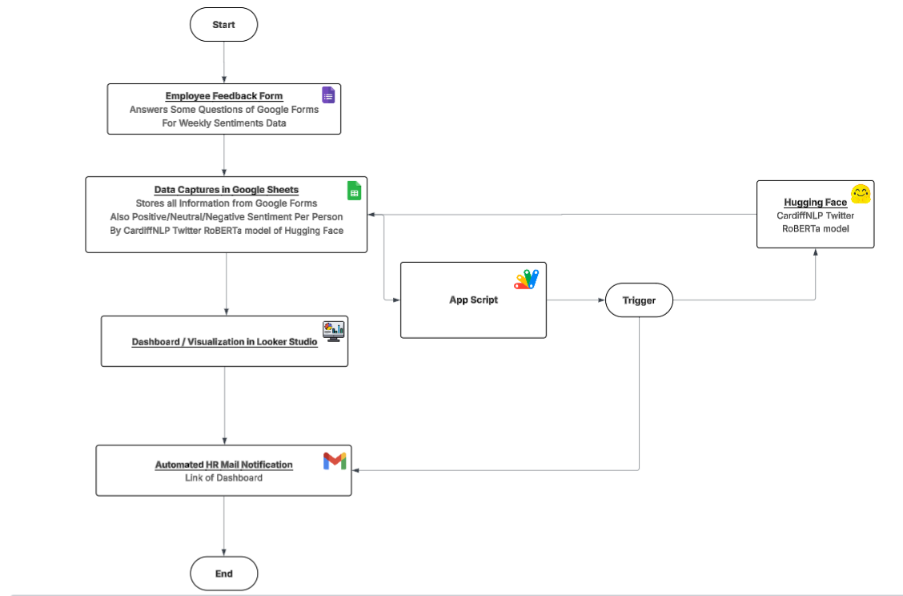
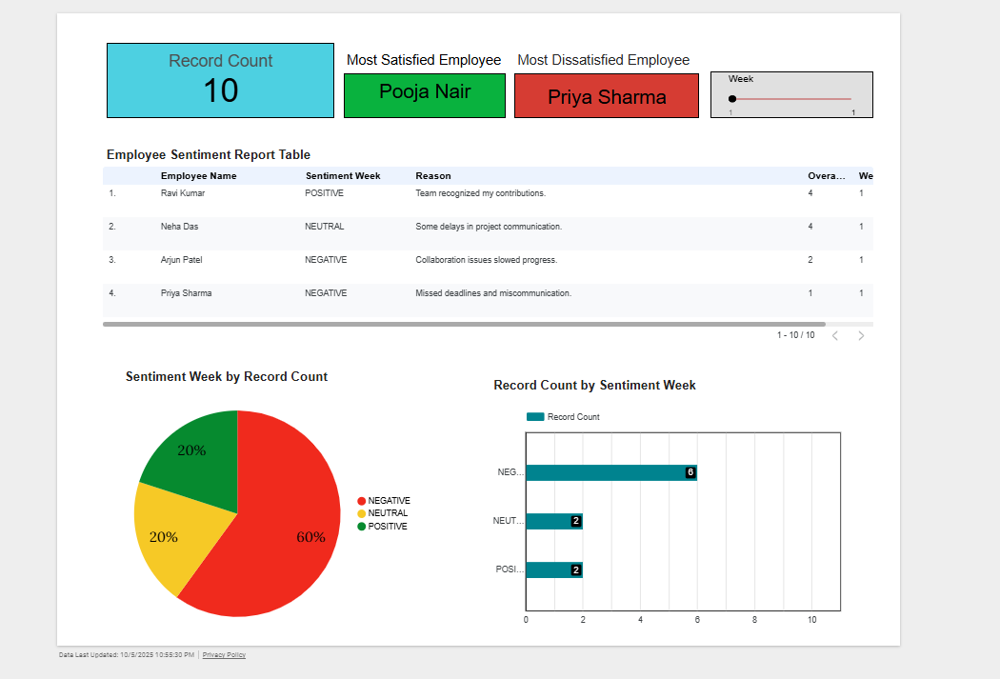

# Automated Employee Feedback & Sentiment Tracker

---

## Problem Overview
In most organizations, employee feedback is collected manually through surveys or informal discussions, making it difficult for HR teams to track changes in employee satisfaction and sentiment over time. Traditional feedback methods often lack automation, leading to delays in analyzing responses and identifying workplace issues. This project introduces an automated solution that collects employee feedback, analyzes sentiments using NLP, and visualizes results in real time — eliminating manual effort and enabling HR to take proactive actions quickly.

---

## Objectives
- Automate employee feedback collection using Google Forms.
- Analyze employee responses automatically using Hugging Face NLP to classify as Positive, Neutral, or Negative.
- Store and manage feedback and sentiment in Google Sheets.
- Visualize weekly insights in Looker Studio dashboards.
- Automatically notify HR with updated reports after each batch of responses.
- Track week-wise sentiment trends to help HR identify improvements or concerns in employee satisfaction.

---

## Useful Links
- **Google Forms:** [Click Here](https://docs.google.com/forms/d/e/1FAIpQLSePwjYzGOriA1Jl0y-B7E3LPrf81TXxOCzCXjGBpBCrQrizkA/viewform?usp=sharing&ouid=106158322406784101412)  
- **Google Sheets:** [Click Here](https://docs.google.com/spreadsheets/d/1t16741lRijUq4RXK95jhoyUiyfLvPxFg3y1iGmR_j7c/edit?usp=sharing)  
- **Looker Studio Dashboard:** [Click Here](https://lookerstudio.google.com/reporting/9af441fa-fbd1-4e6a-935d-2c725ce751f1)  
- **Lucidchart Flowchart:** [Click Here](https://lucid.app/lucidchart/ad545e08-58bb-4f96-93aa-32ea4731c07b/edit?viewport_loc=-811%2C-292%2C3948%2C1666%2C0_0&invitationId=inv_02101f67-7e41-4b0f-a6f0-b70310e7e314)  
- **Project Walkthrough Video (Loom):** [Click Here](https://www.loom.com/share/6bb5535eb18e49fa9c9ec26b51a37647?sid=95cb11f2-52ae-4532-bfe5-c518a6d8945e)

---

## Flowchart

---

## Dashboard

---

## Project Insights
- The system fully automates weekly employee feedback collection, sentiment analysis, and report delivery.  
- HR receives updated dashboards and email alerts without manual effort.  
- Sentiment analysis enables early detection of dissatisfaction or burnout among employees.  
- Employees spend less than 1 minute per week providing feedback, improving participation rates.  
- Weekly trends allow management to take proactive actions to maintain a positive and productive work environment.  

---

## Author
**Ashutosh Sahoo**  
Computer Science and Engineering 
Specialization - Data Science and Analytics | IIIT Nagpur  
[Email](mailto:sahooashutosh792@gmail.com)

